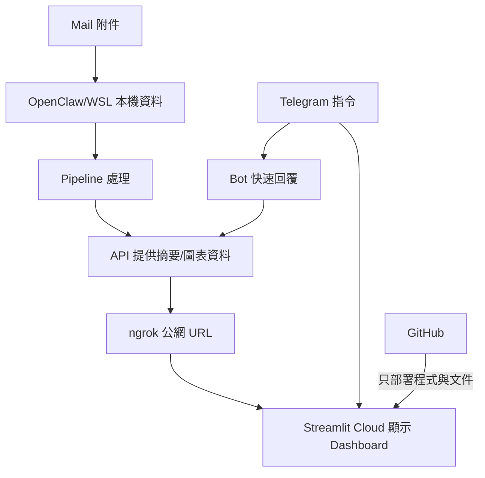

# 檔案更新（教育版）

這份流程是目前正式版 SOP，目標是：
- 讓你每次更新資料都可重現
- 確保資料不上 GitHub
- 讓 Telegram / Streamlit Cloud 能看到最新數字

## 0) 先確認原則

1. `data/`、`*.parquet`、`*.xlsx` 等資料檔不上 GitHub。
2. GitHub 只放「程式碼 + 設定 + 文件」。
3. 圖表資料由本機 API 提供給雲端（透過 ngrok）。

## 1) 準備 3 個來源檔

把 3 個檔案放到 Windows：`C:\Users\ericarthuang\Downloads\`

檔名固定：
- `bond_source.xlsx`
- `stock_source.xlsx`
- `fcn_source.xlsx`

## 2) 一鍵複製 + 跑 pipeline（建議）

在 WSL：

```bash
cd /home/ericarthuang/.openclaw/workspace/investment_dashboard
bash deploy/scripts/update_data_files.sh --run-pipeline
```

這個指令會做兩件事：
1. 把 Downloads 的 3 個檔案複製到 `data/inbox/`
2. 執行 `python run_pipeline.py`

## 3) 驗證本機更新是否成功

```bash
cd /home/ericarthuang/.openclaw/workspace/investment_dashboard
ls -la data/inbox
ls -la data/processed
```

再開本機畫面確認：
- `http://localhost:8501`

## 4) 驗證 API / ngrok 狀態（雲端取數必要）

```bash
systemctl status investment-dashboard-api.service --no-pager
systemctl status investment-dashboard-ngrok-api.service --no-pager
curl -s http://127.0.0.1:8000/health
```

如果 API 健康，確認 chart endpoint：

```bash
curl -s http://127.0.0.1:8000/api/v1/investments/charts/bonds | head
curl -s http://127.0.0.1:8000/api/v1/investments/charts/stocks | head
curl -s http://127.0.0.1:8000/api/v1/investments/charts/fcn | head
```

## 5) 程式碼同步到 GitHub（資料不上傳）

只有在你有改程式或文件時才需要 push。

```bash
cd /home/ericarthuang/.openclaw/workspace/investment_dashboard
git add -A
git restore --staged data/ "*.parquet" "*.xlsx" "*.xls" "*.csv" || true
git status --short
# 確認 staged 清單沒有 data/、parquet、xlsx、xls、csv
git commit -m "update app/docs"
git pull --rebase origin main
git push origin main
```

## 6) 雲端驗證

- Streamlit Cloud：`https://myai-investment-dashboard.streamlit.app/`
- Telegram：送 `/invest`、`/invest bonds`、`/invest stocks`、`/invest fcn`

如果雲端數字沒更新：
1. Streamlit Cloud 按 `Reboot app`
2. 檢查 `INVESTMENT_API_BASE_URL` 是否仍指向最新 ngrok URL

## 7) 常見錯誤與判讀

1. 首頁有數字，但分頁沒圖表：
- 多半是 API 通了，但 chart endpoint 拿不到資料結構。

2. 分頁顯示 API mode 但數值是 N/A：
- 多半是 API 回傳欄位不符或服務版本還沒更新。

3. `git add .` 不小心加到資料：
- 現在有 pre-commit hook 會擋；請再執行：
```bash
git restore --staged data/ "*.parquet" "*.xlsx" "*.xls" "*.csv"
```
## 8) 系統關聯圖（教學版）

```mermaid
flowchart LR
  subgraph Local["OpenClaw / WSL（核心執行環境）"]
    BOT[Telegram Bot]
    API[Investment API]
    PIPE[Pipeline]
    DATA[(Local Data\nExcel / Parquet)]
  end

  GH[(GitHub\nCode + Docs only)]
  ST[Streamlit Cloud UI]
  NG[ngrok]

  TG[Telegram]
  MAIL[Mail\n(attachments)]
  USER[User]

  MAIL -->|下載附件| DATA
  DATA --> PIPE
  PIPE --> DATA
  API --> DATA
  BOT --> API

  USER --> TG
  TG -->|快速查詢| BOT
  TG -->|Open dashboard| ST

  USER --> GH
  GH -->|部署 UI 程式碼| ST

  API --> NG
  NG -->|INVESTMENT_API_BASE_URL| ST
```




## 9) 新環境快速上線
如果你要在新電腦/新 WSL 快速重建，先看：
- docs/BOOTSTRAP_30MIN.md
- 腳本：deploy/scripts/bootstrap_30min.sh
